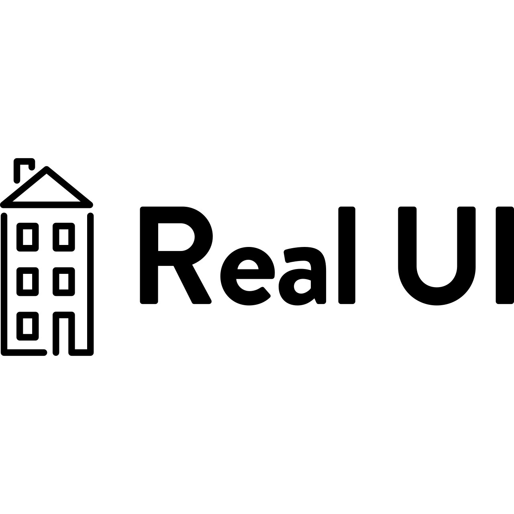

# Real UI

]

> Made with create-react-library

[](https://www.npmjs.com/package/real-estate-ui) [](https://standardjs.com)

### Install

```bash
yarn install
```

To edit the src package and run the demo application in one terminal run `yarn start`, open up a second terminal and run `cd example && yarn start`.

To run storybook simple run `yarn storybook`

### Documentation

### Status

- [ ] Configuring custom compositions in source code to allow for the real time editing of the component library design theme.
- [ ] Create exportable JSON & PDF files from saved theme customization to be used as a custom style guide

### Resources

https://github.com/TechniqueSoftware/react-json-schema#component-mapping
https://rjsf-team.github.io/react-jsonschema-form/
